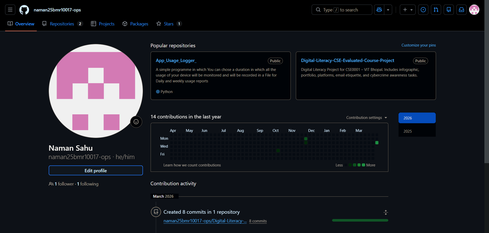
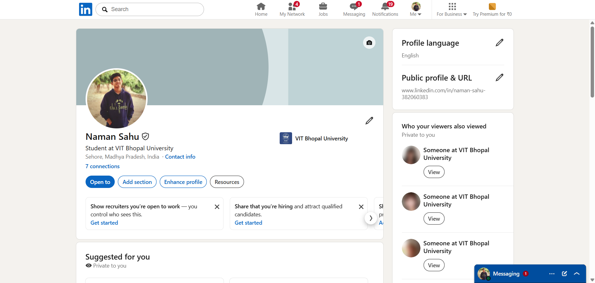
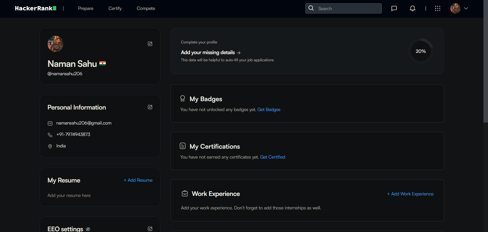

# Digital-Literacy-CSE-Evaluated-Course-Project

Name: Naman Sahu  
Reg No: 25BMR10017 
Branch: Mechanical Engineering (AI & Robotics)
Semester: Winter 2025-26

This repository contains my Digital Literacy Project for CSE0001 course.
Includes infographic, portfolio, platforms, email etiquette, and cybercrime awareness tasks.

## Task 1 – Digital Literacy Infographic

I created an infographic explaining digital literacy, useful tools, and safe internet practices.
[View Infographic](./task-1-presentation/Infographic.png)

## Task 2 – Digital Portfolio

I created my profiles on GitHub, LinkedIn, and HackerRank to build my digital presence.

### Screenshots:
- GitHub Profile  
- LinkedIn Profile  
- HackerRank Profile  

## Task 3 – Platforms

I explored coding and collaboration platforms by solving a problem on HackerRank and creating a Google Form.

[View Google Form](https://docs.google.com/forms/u/0/d/e/1FAIpQLSe4stvz3QtbwFDH6-yQ3XnExeNNjEJZL05bpV0xfdt5Sz80dg/formResponse)

## Task 4 – Email Etiquette

In this task, I created two professional emails and a social media etiquette checklist.

- Email 1: Request for assignment deadline extension  
- Email 2: Internship application email  
- Social Media Do’s and Don’ts checklist  

(See files in task-4-email-etiquette folder)

